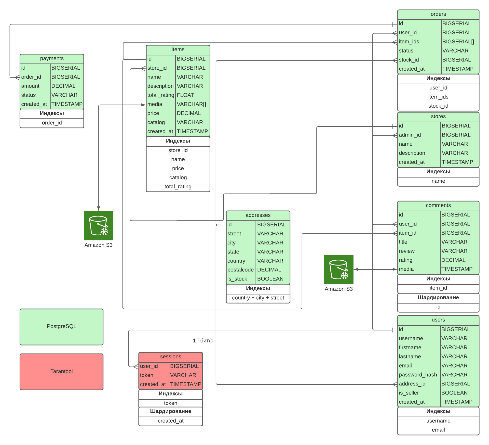
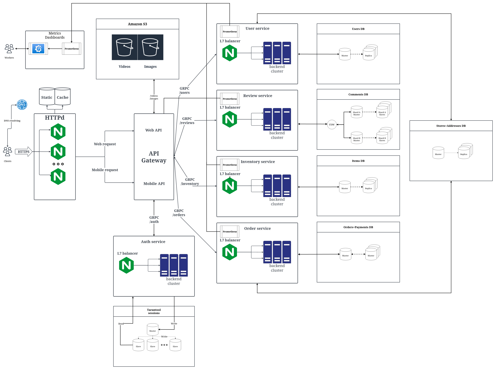

# Course work

[Методические указания](https://github.com/init/highload/blob/main/homework_architecture.md)
---

# Amazon

## Содержание

* ### [Тема и целевая аудитория](#1)
    - #### [Тема](#1.1)
    - #### [Целевая аудитория](#1.2)
* ### [Расчет нагрузки](#2)
    - #### [Продуктовые метрики](#2.1)
    - #### [Технические метрики](#2.2)
        - #### [Сетевой трафик](#2.2.1)
        - #### [RPS](#2.2.2)
* ### [Логическая схема](#3)
* ### [Физическая схема](#4)
    * #### [Схема](#4.1)
    * #### [Обоснование решений](#4.2)
    * #### [Расчет размера хранилищ](#4.3)
* ### [Выбор технологий](#5)
* ### [Схема системы](#6)
    * #### [Схема](#6.1)
    * #### [Описание](#6.2)
* ### [Список серверов](#7)
    * #### [Дата центры](#7.1)
    * #### [Веб сервера](#7.2)
    * #### [Сервисы](#7.3)
    * #### [S3 хранилище](#7.4)

## 1. Тема и целевая аудитория <a name="1"></a>

### 1.1 Тема <a name="1.1"></a>

**[Amazon](https://www.amazon.com/)** - это американская организация, одна из крупнейших в мире среди компаний,
занимающихся продажей всевозможных товаров и услуг через интернет. Также это лидер в области продаж товаров массового
спроса через систему интернет-сервисов.

### MVP:

- Создание профиля покупателя / продавца.
- Добавление товара в корзину.
- Оформление заказа.
- Оценка товара с возможностью оставить комментарий.
- Навигация по товарам (каталог / поиск).
- Создание товаров / каталогов для продавцов.
- Склады и логистика.

### 1.2 Целевая аудитория <a name="1.2"></a>

- Месячный трафик составляет около 2.5 млрд. пользователей
- Аудитория на 59.8% состоит из мужчин и на 40.2% из женщин
- Самая большая возрастная группа посетителей - 25-34-летние (~0.7 млрд.)
- Таргетинг по странам:

| Страна         | Кол-во пользователей в месяц, % | Кол-во пользователей в месяц, млн |
|----------------|---------------------------------|-----------------------------------|
| США            | 82.67                           | 2 066 750                         |
| Канада         | 1.07                            | 26 750                            |
| Индия          | 1.06                            | 26 500                            |
| Великобритания | 0.97                            | 24 250                            |
| Япония         | 0.72                            | 18 000                            |

### [Источник](https://www.similarweb.com/ru/website/amazon.com/)

## 2. Расчет нагрузки <a name="2"></a>

### 2.1 Продуктовые метрики <a name="2.1"></a>

- Дневная аудитория ~28
  млн. [Источник](https://vc.ru/trade/594954-top-zarubezhnyh-marketpleysov-dlya-prodazhi-tovarov-v-2023-amazon-etsy-i-drugie)
- Месячная аудитория ~300 млн. [Источник](https://sell.amazon.com/blog/amazon-stats)

### Средний размер хранилища пользователя:

- Сколько бы я не искал, где можно добавить аватарку, я не нашел такого места => делаем вывод, что аватарок нет.

| Вид данных                                                          | Размер |
|---------------------------------------------------------------------|--------|
| Личные данные (адреса, заказы, платежные данные, транзакции и т.д.) | ~1 Мб  |

Итого: ~1 Мб

### Общая статистика:

- Amazon доставляет 1.6 млн. посылок в день **(1)**
- В Amazon 9.1 млн. продавцов, из которых 2.3 млн. активных

[Источник](https://landingcube.com/amazon-statistics/)

- ~40% пользователей совершают покупку 1-2 раза в месяц **(1)**

[Источник](https://amzmln.com/stati/amazon/statistika-amazon/)

> **(1)** Amazon доставляет **1.6** * 30 = 48 млн. посылок в месяц, также активных пользователей в месяц 300 млн, из них
> 40% = 120 млн. совершают 1 - 2 покупки в месяц.
>
> Соответственно, получаем, что в среднем пользователь заказывает (с
> добавлением в корзину) 120 * 1.5 / 48 = 3.75 товаров, однако это для 40% пользователей ⇒ получаем ~ **2 товара в
> посылке** в среднем для одного пользователя.
>
> Выходит ~ **0.16 заказов на пользователя в месяц**. (48 млн. заказов / 300 млн. пользователей).
>
> Из этого можно сделать приближенный вывод, что он добавляет около **1.5 товара в корзину в месяц**.

- 6,264 продавцов присоединяются к Amazon ежедневно

[Источник](https://financesonline.com/amazon-statistics/)

- Согласно отчету статистической компании Marketplace Pulse на июнь 2021 года, на Amazon есть более 2,5 миллиона
  продавцов, и среди них наибольшее количество товаров предлагают крупные магазины и бренды, которые имеют более 10 000
  товаров в своем ассортименте. Однако, большинство продавцов на Amazon имеют от 1 до 100 товаров в своем ассортименте.

> Предположим, что в среднем продавец создает **5 товаров** в месяц.

- 1-3% пользователей оставляют ревью после покупки товара **(2)**

[Источник](https://www.quora.com/What-percentage-of-buyers-write-reviews-on-Amazon)

> **(2)** 2% пользователей в месяц (300 * 2% = 6 млн) оставляют отзыв в месяц на товар. В среднем в месяц 1 пользователь
> приобретает 2 товара. Получается, что 6 млн пользователей в месяц остовляют отзыв о 2-х купленных товарах ⇒ 6 млн *
> 2 = 12 млн товаров в месяц пополняются отзывом. Найдем процент от общего количества товаров в месяц: 12 млн / 48 млн *
> 2 = 1.25 %. Один пользователь в месяц покупает 0.32 товара ⇒ пользователь оставляет 0.32 * 1.25% = 0.004 отзывов в
> месяц.

### Среднее количество действий пользователя по типам:

| Тип запроса                                       | Запросов в месяц |
|---------------------------------------------------|------------------|
| Добавление товара в корзину                       | 1.5              |
| Оформление заказа                                 | 0.16             |
| Оценка товара с возможностью оставить комментарий | 0.004            |
| Создание товаров / каталогов                      | 5                |

### 2.2 Технические метрики <a name="2.2"></a>

### Сетевой трафик <a name="2.2.1"></a>

- В месяц 2.5 млрд. (~1000 пользователей в секунду) посетителей сайта, которые
  в [среднем](https://www.similarweb.com/ru/website/amazon.com/#traffic) посещают около 9 страниц за 7 минут.

Предположим, что общий RPS сайта `1000 * 2 = 2000`, где берутся в учет ретраи, долгие выполнения, ошибки и т.д.

| Место      | Формула                          | Кол-во подгружаемых товаров |
|------------|:---------------------------------|:----------------------------|
| Каталог    | 24 товара + 20 * 2 рекомендаций  | 64                          |
| Поиск      | 16 товаров + 20 * 2 рекомендаций | 56                          |
| Сортировка | аналогично каталогу              | 64                          |
| Товар      | 1 товар                          | 1                           |

Для того чтобы подсчитать RPS, нужно обусловить распределение по типам запросов.
Не забываем про добавление в корзину с RPS = ```1.5 * 300 000 000 пользователей / 30 дней / 24 часа / 60
минут / 60 секунд ~= 80 RPS```

| Действие             | Распределение | RPS  |
|----------------------|---------------|------|
| Отображение каталога | 50%           | 1000 |
| Страница поиска      | 25%           | 500  |
| Сортировка товаров   | 16%           | 320  |
| Отображение товара   | 5%            | 100  |
| Добавление в корзину | 4%            | 80   |

Оформление заказа не учитываем, так как это крайне редкое действие.

#### Вычисляем трафик:

* Клик на товар подгружает 15 Мб данных.
* Предпросмотр товара подгружает
    * Рейтинг товара (1 Кб)
    * Сжатую картинку (500 Кб)
* Добавление товара в корзину
    * Опустим этот запрос в трафике, так как он достаточно легковестный, и максимум меняет поле в БД.

Протокол передачи **HTTPS**.

| RPS  | Вес единицы | Кол-во единиц | Сумма                        |
|------|-------------|---------------|------------------------------|
| 1000 | 500 Кб      | 64            | 64 * 500 Кб * 1000 = 32 Гб   |
| 500  | 500 Кб      | 56            | 56 * 500 Кб * 500 = 14 Гб    |
| 320  | 500 Кб      | 64            | 64 * 500 Кб * 400 = 10.24 Гб |
| 100  | 15 Мб       | 1             | 1 * 150 Мб * 100 = 15 Гб     |

Итого:

> 32 + 14 + 10.24 + 15 = 71.24 Гбайт/с = 569.92 Гбит/с
>
>
> 71.24 * 24 * 60 * 60 = 6 155 136 Гбайт/c

Трафик в секунду: **569.92 Гбит/с**

Трафик в сутки: **6 155 136 Гбайт/c**

### Пиковый

Предположим, что пиковый трафик вырастает в 2 раза, тогда имеем:

Трафик в секунду: **1139.84 Гбит/с**

Трафик в сутки: **12 310 272 Гбайт/с**

### RPS <a name="2.2.2"></a>

### Средний

1. Оформление заказа
   1.6 млн. заказов в день ⇒ **18.5 заказов в секунду**.
2. Добавление товара в корзину
   **80 добавлений в секунду**
3. Отзыв о товаре
   300 млн * 0.004 = 1.2 млн отзывов в месяц. 1.2 млн / 30 дней / 24 часа / 60 минут / 60 секунд = **0.46 отзывов в
   секунду.**
4. Поиск
   **500 поисков в секунду**.
5. Просмотр каталога товаров
   **1000 каталогов в секунду**
6. Сортировка товара
   **320 сортировок в секунду**
7. Просмотр товара (превью)
   (56 + 64 * 2) / 3 = 61.3 товара в среднем отображается. Запросов на просмотр в сумме 1 900 => 1 900 * 61.3 = **116
   533 превью в секунду**.
8. Просмотр товара (полностью)
   **100 просмотров товара полностью в секунду**
9. Аутентификация
   Предположим, что [DAU](#2.1) - это кол-во запросов на аутентификацию в день. Тогда не сложны вычислить RPS = 48
   млн. / 24 часа / 60 минут / 60 секунд = **555 RPS**.
10. Создание товара
    Пренебрегаем этим действием, так как оно происходит очень редко и, соответственно, не особо влияет на загруженность
    системы.

### Пиковый

Предположим, что рост RPS в пике будет в 2 раза больше:

| Тип запроса                 | Средний RPS | Пиковый RPS |
|-----------------------------|-------------|-------------|
| Оформление заказа           | 18.5        | 37          |
| Добавление товара в корзину | 80          | 160         |
| Отзыв о товаре              | 0.74        | 1.48        |
| Поиск                       | 500         | 1 000       |
| Просмотр каталога           | 1 000       | 2 000       |
| Сортировка товаров          | 400         | 800         |
| Просмотр товара (превью)    | 116 533     | 233 066     |
| Просмотр товара (полностью) | 100         | 200         |
| Аутентификация              | 555         | 1110        |
| Создание товара             | 0           | 0           |

## 3. Логическая схема <a name="3"></a>


## 4. Физическая схема <a name="4"></a>

### 4.1 Схема <a name="4.1"></a>



### 4.2 Обоснование решений <a name="4.2"></a>

Предусматривается репликация данных для PostgreSQL. Стратегию выберем простую синхронную Master-Slave репликацию для
всех баз данных, кроме Orders, Payments. Для них выберем Master-Master (Active-Passive), так как они нечасто
обновляются и необходима высокая доступность для платежей и заказов.

Выводы про размеры хранилищ были основаны на [расчетах](#4.3). Частота действий - здравый смысл.

#### Orders

Таблица с заказами. Содержит в себе информацию о заказе, а также о пользователе, который его сделал.

- Размер: маленький
- Частота чтения: высокая
- Частота записи: низкая
- Частота обновления: низкая
- Частота удаления: низкая
- Индексы:
    - user_id - для быстрого поиска заказов по пользователю
    - item_ids - для быстрого поиска заказов по товарам
    - stock_id - для быстрого поиска заказов по складу

#### Payments

Таблица с платежами. Содержит в себе информацию о платеже, статус и дату создания.

- Размер: маленький
- Частота чтения: средняя
- Частота записи: низкая
- Частота обновления: низкая
- Частота удаления: низкая
- Индексы:
    - order_id - для быстрого поиска платежей по заказу

#### Items

Таблица с товарами.

- Размер: средний
- Частота чтения: очень высокая
- Частота записи: низкая
- Частота обновления: средняя
- Частота удаления: низкая
- Индексы:
    - store_id - для быстрого поиска товаров по магазину
    - name - для быстрого поиска товаров по названию
    - price - для сортировки товаров по цене
    - catalog - для сортировки по каталогу
    - total_rating - для сортировки по рейтингу

#### Stores

Таблица с магазинами (продавцами).

- Размер: маленький
- Частота чтения: средняя
- Частота записи: низкая
- Частота обновления: средняя
- Частота удаления: низкая
- Индексы:
    - name - для быстрого поиска магазинов по названию

#### Addresses

Таблица с адресами.

- Размер: маленький
- Частота чтения: средняя
- Частота записи: средняя
- Частота обновления: средняя
- Частота удаления: средняя
- Индексы:
    - country + state + city + street - для быстрого поиска адреса (очень высокая селективность для каждого поля)

#### Comments

Таблица с отзывами.

- Размер: большой
- Частота чтения: высокая
- Частота записи: средняя
- Частота обновления: низкая
- Частота удаления: высокая (очень часто приходится удалять некорректные / накрученные отзывы)
- Индексы:
    - item_id - для быстрого поиска отзывов по товару
- Шардирование:
    - Поля:
        - item_id
    - Алгоритм - естественное шардирование (item_id % num_shards)

#### Users

Таблица с пользователями.

- Размер: средний
- Частота чтения: средняя
- Частота записи: низкая
- Частота обновления: средняя
- Частота удаления: низкая
- Индексы:
    - username - для быстрого поиска пользователя по имени
    - email - для быстрого поиска пользователя по email (логин по email тоже разрешен)

#### Sessions

Таблица с сессиями.

- Размер: большой
- Частота чтения: высокая
- Частота записи: высокая
- Частота обновления: низкая
- Частота удаления: низкая
- Индексы:
    - token - для быстрого поиска пользователя по уникальному токену сессии (primary key в tarantool)
- Шардирование: (для удаления сессий, которым больше года)
    - Поля:
        - created_at
    - Алгоритм - хэширование (дефолтное в tarantool)

### 4.3 Расчет размера хранилищ <a name="4.3"></a>

### Адрес

- Всего адресов будет порядка 900 млн. (общее кол-во пользователей, магазинов пренебрежимо мало).

- id - 4 байта
- street ~ 50 байт
- city ~ 15 байт
- state ~ 15 байт
- country ~ 10 байт
- postal_code - 8 байт
- is_stock - 1 байт

Итого: **103 байта**

### Товар

- Всего товаров примерно 125 млн (учитываем, что 2.5 млн. продавцов имеют в среднем 50 товаров).

#### Медиа (S3)

- Amazon рекомендует, чтобы размер изображения составлял не менее 1000 пикселей в высоту или ширину, и чтобы для
  достижения оптимального качества и сжатия использовать формат файла JPEG или PNG. В общем, размер фото товара на
  Amazon может колебаться от нескольких десятков килобайт до нескольких мегабайт, в зависимости от размеров изображения
  и его качества, возьмем среднее **1 Мб на фото**. Учитываем, что для электронных товаров, которые являются наиболее
  популярными продавцы часто прикрепляют еще и видео.
- В целом, количество фотографий для листинга продукта на Amazon может быть от 1 до 10 и более. Возьмем 5 фотографий (1
  Мб) + 2 видео (предположим 5Мб).

[Источник](https://www.repricerexpress.com/amazon-statistics/)

Итого: 5 * 1 + 2 * 5 Мб ~= **15 Мб данных на каждый товар**

#### Прочее (PostgreSQL)

- id - 4 байта
- store_id - 4 байта
- name ~ 50 байт
- description ~ 100 байт
- price - 4 байта
- catalog ~ 10 байт
- media ~ 100 байт
- created_at - 8 байта

Итого: **280 байт**

### Пользователь

- Предположим, что всего пользователей больше [MAU](#2.1) в 3 раза. То есть 3 * 300 млн = 900 млн.

- id - 4 байта
- username ~ 20 байт
- firstname ~ 20 байт
- lastname ~ 20 байт
- email ~ 50 байт
- password_hash ~ 256 байт
- address_id - 4 байта
- is_seller - 1 байт
- created_at - 8 байта

Итого: **379 байт**

### Сессии

- Активных пользователей в месяц - 300 млн. (по [этим](#2.1) данным). Предположим, что сессий в год будет в 12 раз
  больше (учитываем новых пользователей, сессии с разных устройств, забытые пароли от аккаунта и прочие моменты). То
  есть 12 * 300 млн = 3.6 млрд.

- user_id - 4 байта
- token - 256 байт
- created_at - 8 байта

Итого: **268 байт**

### Магазины

- [Всего](#2.1) продавцов 9.1 млн.

- id - 4 байта
- admin_id - 4 байта
- name ~ 50 байт
- description ~ 200 байт
- created_at - 8 байта

Итого: **266 байт**

### Отзывы

- Предположим, что 40% товаров имеют 250 отзывов, а остальные 60% лишь 20 отзывов в среднем, тогда всего 0.4 * 125 млн *
  250 + 0.6 * 125 млн * 20 = 14 млрд отзывов.
- Предположим, что 5% отзывов имеют фото, а 2% видео, тогда всего 0.05 * 14 млрд = 700 млн фото и 0.02 * 14 млрд = 280
  млн видео.

#### PostgreSQL

- id - 4 байта
- user_id - 4 байта
- item_id - 4 байта
- title ~ 50 байт
- review ~ 200 байт
- rating - 4 байт
- media ~ 100 байт

Итого: **366 байт**

#### Медиа (S3)

- Фото - 1Мб
- Видео - 5Мб

### Заказы

- В месяц проходит 48 млн. заказов. Предположим, что данные о товарах хранятся около 10 лет (с запасом
  для статистики, аналитики, возврата, гарантии и т.д.). Получаем 48 млн. * 12 мес. * 10 лет = 5.76 млрд. заказов.

- id - 4 байта
- user_id - 4 байта
- item_ids ~ 8 байт
- status - 5 байт
- stock_id - 4 байта
- created_at - 8 байта

Итого: **33 байта**

### Платежи

- Аналогично заказам, 5.76 млрд. платежей, пусть еще 5% платежей будут отменены, тогда 5.76 млрд. * 1.05 = 6.05 млрд.
  платежей.

- id - 4 байта
- order_id - 4 байта
- amount - 4 байта
- status - 5 байт
- created_at - 8 байт

Итого: **25 байт**

| Название            | Кол-во записей, млн. | Формула            | Вес хранилища, Гб | Тип хранилища |
|---------------------|----------------------|--------------------|-------------------|---------------|
| Адрес               | 900                  | 900 млн. * 103 Б   | 86 Гб             | PostgreSQL    |
| Товар (информация)  | 125                  | 125 млн. * 280 Б   | 32 Гб             | PostgreSQL    |
| Товар (медиа)       | 125                  | 125 млн. * 15 Мб   | 1 780 000 Гб      | S3            |
| Пользователь        | 900                  | 900 млн. * 379 Б   | 317 Гб            | PostgreSQL    |
| Сессии              | 3600                 | 3600 млн. * 268 Б  | 900 Гб            | Tarantool     |
| Магазины            | 9.1                  | 9.1 млн. * 266 Б   | 3 Гб              | PostgreSQL    |
| Отзывы (информация) | 14000                | 14000 млн. * 366 Б | 4 660 Гб          | PostgreSQL    |
| Отзывы (фото)       | 700                  | 700 млн. * 1 Мб    | 667 000 Гб        | S3            |
| Отзывы (видео)      | 280                  | 280 млн. * 5 Мб    | 1 335 000 Гб      | S3            |
| Заказы              | 5760                 | 5760 млн * 33 Б    | 177 Гб            | PostgreSQL    |
| Платежи             | 6050                 | 6050 млн * 25 Б    | 140 Гб            | PostgreSQL    |

#### Итого выходит:

> 29 + 32 + 1 780 000 + 317 + 900 + 3 + 4 660 + 667 000 + 1 335 000 + 177 + 140 = 3 788 258 Гб = 3 788 Тб = 3.8 Пб

Итого, для хранения данных нам понадобится **3.8 Пб**.

## 5. Выбор технологий <a name="5"></a>

| Технология            | Область применения | Мотивация                                                                                                                                                                   |
|-----------------------|--------------------|-----------------------------------------------------------------------------------------------------------------------------------------------------------------------------|
| React + TS            | Frontend           | Самый популярный и функциональный фреймворк на данный момент. TS уменьшает кол-во багов на проде.                                                                           |
| Webpack               | Frontend           | Сжатие файлов в бандлы. Удобная сборка проекта.                                                                                                                             |
| Golang                | Backend            | Быстрая компиляция, крутая многопоточка, статическая типизация, удобное построение сетевых взаимодействий: микросервис/клиенты.                                             |
| Nginx                 | HTTPd              | Лучший HTTPd на данный момент. Киллер фитча - автообновление сертификатов. Также балансировка и кеширование.                                                                |
| PostgreSQL            | DBMS               | Отличная СУБД, которая прекрасно справляется с масштабированием, имеет много дополнительных фитчей, помогающих оптимизировать запросы                                       |
| Tarantool             | In-memory DB       | Быстрая для чтения и записи. Используем для сессий. Поддерживает шардирование(vshard), репликацию.                                                                          |
| Amazon S3             | S3 storage         | В контексте данной курсовой - это собственная реализация S3 хранилища. Не нужно платить cloud провайдерам.                                                                  |
| Prometheus + Graphana | Metrics            | Достаточно популярная и удобная связка. Прекрасная настройка дэшбордов в Graphana.                                                                                          |
| Swift                 | Mobile IOS         | Мировые тенденции говорят о том, что большинству пользователей удобней работать с мобильными приложениями, нежели с web-приложениями. Swift позволяет создать такое на IOS. |
| Kotlin                | Mobile Android     | Android - самая популярная операционная система для телефонов в мире. Поэтому появляется необходимость в нативном приложении.                                               |

## 6. Схема системы <a name="6"></a>

### 6.1 Схема <a name="6.1"></a>



### 6.2 Описание <a name="6.2"></a>

#### Архитектура

Была выбрана микросервисная архитектура с использованием API Gateway, который выполняет множество функций:

- Единая точка входа в систему
- Клиенты не знают как устроена микросервисная архитектура
- API индивидуально для каждого вида клиента (веб или мобильный)
- Уменьшение кол-ва запросов/roundtrip'ов
- Единая компонент для микросервисного взаимодействия
- Повышение безопасности и масштабируемости

Всего 5 микросервисов:

- Пользователи
- Отзывы
- Товары
- Заказы
- Аутентификация/авторизация

#### Балансировка

Балансировка происходит на следующих уровнях:

- Сетевой
- Прикладной
- Транспортный

#### Путь запроса

1. Сначала клиент ресолвит IP адрес делая запрос на DNS сервер.
2. Получив IP адрес, клиент делает запрос на один из серверов nginx, который в свою очередь отдает статику, кэширует
   запрос и пробрасывает его на API Gateway.
3. API Gateway кэширует запросы, если это возможно, отдает метрики.
4. API Gateway идет в микросервис аутентификации, который проверяет токен и возвращает информацию о пользователе.
5. С этими данными API Gateway идет в нужный микросервис, который возвращает или меняет данные.
6. На каждом входе в микросервис происходит балансировка L7 уровня на нужный backend.
7. В случае, если необходимо взять какие-то данные из S3 хранилища, то API Gateway легко справится с этим.

При работе с БД в микросервисе происходит балансировка на нужный шард разными способами. Причем стоит отметить некоторые
особенности реплицирования:

- Для Users, Reviews, Inventory используется Master-Slave репликация, где мы открываем Master для записи, а Slave для
  чтения.
- Для Orders используется Master-Master репликация, где мы открываем оба Master'а для записи и чтения. Причем данные
  пробрасываются синхронно. Это необходимо для обеспечения отказоустойчивости, а также консистентности данных.

Для PostgreSQL используется расширение postgres_fdw, которое позволяет делать запросы к разным шардам.

Для Tarantool используется расширение cartridge, которое позволяет делать запросы к разным шардам и удобно настраивать
роутинг вцелом.

## Список серверов <a name="7"></a>

**Все характеристики серверов взяты исходя из пикового значения RPS.**

### 7.1 Дата центры <a name="7.1"></a>

Расположение и кол-во дата центров выбираем исходя из [аудитории](#1.2):

- США - 6 дата центров + 2 резервных
- Европа - 4 дата центра + 1 резервных

### 7.2 Веб-сервера <a name="7.2"></a>

Пользуемся [этими](https://www.nginx.com/blog/testing-the-performance-of-nginx-and-nginx-plus-web-servers/) бэнчмарками.

Суммарный трафик на сервис = [1139.84 Гбит/с](#2.1.1). В основном все ответы весят 500 Кбайт. Примем, что одно ядро
может обработать 250 таких запросов в секунду (исходя из бенчмарков, получим примерно 483 RPS, поделим пополам, чтобы
сервера не работали на максимум) (всего 1820 RPS). Тогда получаем, что один сервер имеет `1820 / 250 = 7.28 ядер`.
Однако отношение суммарного трафика к Network сервера (40 Гбит/с) намного больше, поэтому есть смысл выделить лишь 2
ядра на сервер и 8 Гбайт RAM. Storage под статику возьмем 120 Гбайт SSD на сервер.

Конфигурация сервера:

| Параметр | Значение      |
|----------|---------------|
| CPU      | 2 ядер        |
| Network  | 40 Гбит/c     |
| RAM      | 8 Гбайт       |
| Storage  | 120 Гбайт SSD |

Итого:

`1139.84 / 40 ~ 29 серверов`

### 7.3 Сервисы <a name="7.3"></a>

#### API Gateway

Сервис, который принимает запросы от клиента, кэширует их, а также пробрасывает их в нужный микросервис.

Весь трафик будет проходить через этот сервис. Storage ему нужен только для ОС, поэтому возьмем 120 Гбайт SSD.

Памяти будет использовано достаточно много, поэтому имеет смысл выделить 32 Гб RAM на сервера.

На каждый инстанс будет приходить трафик с одного веб сервера => трафик 40 Гбит/с.

Пусть 1 ядро обрабатывает 250 RPS (запросы в основном тяжелые 500 Кб), тогда нам понадобится 8 ядер всего.

Конфигурация сервера:

| Параметр | Значение      |
|----------|---------------|
| CPU      | 2 ядер        |
| Network  | 10 Гбит/c     |
| RAM      | 8 Гбайт       |
| Storage  | 120 Гбайт SSD |

Всего серверов: **4**

#### Users

Этот сервис не сильно загружен, а только используется для поиска по большим массивам (900 млн.) данных.

| Запрос                      | RPS                | Вес запроса | Вес ответа   | Входящий трафик, Мбит/c | Исходящий трафик, Мбит/c |
|-----------------------------|--------------------|-------------|--------------|-------------------------|--------------------------|
| Аутентификация              | 1 110              | 4 Б         | 379 Б        | пренебрегаем            | 379 Б * 1 110 = **3**    |
| Отзывы о товаре             | 200 * 112 = 22 400 | 4 Б         | 379 Б        | пренебрегаем            | 379 Б * 22 400 = **8**   |
| Добавление товара в корзину | 160                | 4 Б         | пренебрегаем | пренебрегаем            | пренебрегаем             |

В основном его грузят сервис Auth и Review, потому что нигде больше данные пользователя не используются так активно
(оплатой пренебрегаем, т.к. это очень редкий запрос).

Трафик: `3 + 8 = 11 Мбит/c` (возьмем 100 Мбит/c - этого вполне достаточно для 1 сервера)

#### Сервис

Предположим, что 1 ядро способно обработать 1000 RPS. Тогда получаем, что нам нужно 23 ядра.
Если взять конфигурацию в 8 ядер, то всего нужно `23 / 8 = 3` сервера, которые будут ходить в БД.

RAM'а в 4 Гбайта вполне хватит для 1 сервера, ведь мы просто ходим в БД и выделяем память под небольшие структуры
данных. Storage возьмем 120 Гбайта SSD для ОС и приложения.

Итого конфигурация:

| Параметр | Значение      |
|----------|---------------|
| CPU      | 8 ядер        |
| Network  | 100 Мбит/c    |
| RAM      | 4 Гбайт       |
| Storage  | 120 Гбайт SSD |

Серверов: `23 / 8 = 3`

#### БД

Из базы в основном читаем. Для эффективной работы с индексами выделим 16 Гбайт RAM (в 2 раза больше, чем для юзеров, так
как хранилище в два раза больше) на машину. Также возьмем 8 ядер CPU для постгреса. Storage в 500 Гбайт SSD хватит,
учитывая, что всего данных занимается [317 Гбайт](#4.3) с запасом для индексов.

Итого конфигурация:

| Параметр | Значение      |
|----------|---------------|
| CPU      | 8 ядер        |
| Network  | 100 Мбит/c    |
| RAM      | 16 Гбайт      |
| Storage  | 500 Гбайт SSD |

Учитываем, что у нас будет 1 Master и 3 Replica. Тогда получаем, что нам нужно **4 сервера**.

По мере необходимости можно докупать новые сервера.

#### Inventory

Весов запросов для показа превью как такового нет, потому что мы отдаем список, как
рекомендацию. Сортировка товара и поиск включены в просмотр с превью, так как RPS уже посчитан с их учетом.

| Запрос                      | RPS     | Вес запроса  | Вес ответа | Входящий трафик, Мбит/c | Исходящий трафик, Мбит/c  |
|-----------------------------|---------|--------------|------------|-------------------------|---------------------------|
| Просмотр товара (превью)    | 233 066 | пренебрегаем | 280 Б      | пренебрегаем            | 280 Б * 233 066 = **500** |
| Просмотр товара (полностью) | 200     | 4 Б          | 280 Б      | пренебрегаем            | пренебрегаем              |

В основном сервис будет отдавать большие пачки данных (по 60 товаров) на каждый запрос, поэтому имеет смысл взять
большой Network.

Трафик: `500 Мбит/c`

#### Сервис

Предположим, что 1 ядро способно обработать 2 500 RPS (то есть просто сходить в БД и отдать информацию 280 Байт
клиенту). Тогда получаем, что нам нужно 94 ядра. RAM на один сервер будет хватать в 8 Гбайт. Storage возьмем 120 Гбайта
SSD для ОС и приложения. Возьмем 16 CPU для одного сервера, чтобы он мог обрабатывать 40 000 RPS.

Конфигурация сервера:

| Параметр | Значение      |
|----------|---------------|
| CPU      | 16 ядер       |
| Network  | 1 Гбит/c      |
| RAM      | 8 Гбайт       |
| Storage  | 120 Гбайт SSD |

Всего машин: `94 / 16 = 6`

#### БД

Запись будет очень редкой, а чтений будет много, поэтому нужно выделить побольше RAM для индексов - 32 Gb.
[32 Гбайта](#4.3) данных по всем товарам (их 150 млн.), поэтому хватит SSD на 500 Гбайт, учитывая тяжелые индексы.

Учитываем, что RPS довольно высокие, следовательно, будет целесообразно взять 16 ядер CPU для постгреса.

Реплицирование: 1 Master и 6 Replica, то есть 7 серверов.

| Параметр | Значение      |
|----------|---------------|
| CPU      | 16 ядер       |
| Network  | 200 Мбит/c    |
| RAM      | 32 Гбайт      |
| Storage  | 500 Гбайт SSD |

#### Review

Опять же сервис, в который редко пишут, но очень часто читают, поэтому нужна аккуратная работа с БД, нежели с сервисом.
Основной запрос один - это получение отзывов по товару. Каждый товар имеет поле total_rating, поэтому не нужно
добавлять запросы на просмотр превью товара в табличку ниже, а только на просмотр полного товара. Как мы считали выше,
один товар имеет в среднем 112 отзывов, которые весят 366 Б. Тогда одно получение отзывов по товару будет иметь
трафик `366 Б * 112 = 36.7 КБ`.

| Запрос                      | RPS | Вес запроса  | Вес ответа | Входящий трафик, Мбит/c | Исходящий трафик, Мбит/c |
|-----------------------------|-----|--------------|------------|-------------------------|--------------------------|
| Получение отзывов по товару | 200 | пренебрегаем | 36.7 КБ    | пренебрегаем            | 200 * 36.7 КБ = **58**   |

Трафик: `58 Мбит/c`

#### Сервис

Предположим, что 1 ядро обрабатывает 100 RPS. Тогда получаем, что нам нужно 2 ядра. RAM на один сервер будет хватать 16
Гбайт, потому что будут очень тяжелые выделения памяти для структуры с множеством отзывов.

Конфигурация сервера:

| Параметр | Значение      |
|----------|---------------|
| CPU      | 2 ядер        |
| Network  | 200 Мбит/c    |
| RAM      | 16 Гбайт      |
| Storage  | 120 Гбайт SSD |

Всего серверов: `4 / 4 = 1`

#### БД

Нужно выделить достаточно RAM для индексов - 24 Гбайт (для индексации по 500 Гб данных в каждом
инстансе).

[4 660 Гбайт](#4.3) данных по всем отзывам, шардируем по полю `id`.

Возьмем storage на одном сервисе в 500 Гбайт SSD, тогда нужно будет 10 серверов с шардами (еще по 1 реплике на каждый
шард).

Репликация: 10 Master и 20 Replica = **30 серверов**. (шардируем между 10 мастерами, при этом на каждый по 2 реплики)

| Параметр | Значение      |
|----------|---------------|
| CPU      | 8 ядер        |
| Network  | 100 Мбит/c    |
| RAM      | 24 Гбайт      |
| Storage  | 500 Гбайт SSD |

#### Order

Записи и чтения очень редкие, одного нужно подержать максимальную отказоустойчивость сервиса. Основной запрос один - это
заказ товара. Работа с БД будет исключительно транзакционной. А запросы будут асинхронные.

| Запрос | RPS | Вес запроса  | Вес ответа   | Входящий трафик, Мбит/c | Исходящий трафик, Мбит/c |
|--------|-----|--------------|--------------|-------------------------|--------------------------|
| Заказ  | 37  | пренебрегаем | пренебрегаем | пренебрегаем            | пренебрегаем             |

#### Сервис

Так как запросы асинхронные и достаточно низкий RPS, то нет смысла использовать много ресурсов на каждый сервер.
Предположим, что 1 ядро обрабатывает намного больше, чем 37 RPS.

Тогда получаем, что нам нужно 1 ядро. RAM на один сервер будет хватать 4 Гбайта.
Network - 100 Мбит/с. Для storage хватит HDD на 250 Гбайт.

Конфигурация сервера:

| Параметр | Значение      |
|----------|---------------|
| CPU      | 1 ядро        |
| Network  | 100 Мбит/c    |
| RAM      | 4 Гбайт       |
| Storage  | 250 Гбайт HDD |

#### БД

Транзакции будут с уровнем изоляции Serializable. Весит хранилище 177 + 140 = 317 Гбайт. Поэтому на одном сервере
должно быть 500 Гбайт HDD.

Репликация: По 1 Master'у в каждом датацентре (8 + 5 = 13 ДЦ) и по 2 Replica на каждый Master. Причем данные между
мастерами в разных ДЦ будут сихронно реплицироваться.

RAM только для 1 индекса - `order_id` для получения статуса оплат по заказу, поэтому можно остановиться на 8 Гб.

| Параметр | Значение      |
|----------|---------------|
| CPU      | 2 ядра        |
| Network  | 100 Мбит/c    |
| RAM      | 8 Гбайт       |
| Storage  | 500 Гбайт HDD |

Серверов: 13 * (1 + 2) = 39 серверов.

#### Auth

| Запрос         | RPS   | Вес запроса | Вес ответа   | Входящий трафик, Мбит/c | Исходящий трафик, Мбит/c |
|----------------|-------|-------------|--------------|-------------------------|--------------------------|
| Аутентификация | 1 110 | 4 Б         | 379 Б        | пренебрегаем            | 379 Б * 1 110 = **3**    |
| Регистрация    | 1     | 379 Б       | пренебрегаем | пренебрегаем            | пренебрегаем             |

#### Сервис

Сервис нужен для того, чтобы ходить в tarantool за сессиями пользователя. Предположим, что 1 ядро обрабатывает 1000 RPS.
Тогда получаем, что нам нужно 2 ядра. RAM на один сервер хватит 4 Гб (сессия - легковесная структура данных).

Конфигурация сервера:

| Параметр | Значение      |
|----------|---------------|
| CPU      | 1 ядро        |
| Network  | 100 Мбит/c    |
| RAM      | 4 Гбайт       |
| Storage  | 500 Гбайт HDD |

Количество серверов: **2**

#### БД

База данных Tarantool, она является in-memory базой данных, поэтому нужно брать RAM для поддержания 1100 RPS с трафиком
3 Мбит/с. Возьмем 1 день хранения сессий в RAM: `3 * 60 * 60 * 24 = 31 Гб ~= 32 Гб`.

Вес хранилища [900 Гб](#4.3), шардируем по полю `created_at`.

Предположим, что на одном ядре будет выполняться намного больше запросов, чем нам нужно, поэтому этой метрикой
пренебрежем.

| Параметр | Значение      |
|----------|---------------|
| CPU      | 4 ядро        |
| Network  | 100 Мбит/c    |
| RAM      | 32 Гбайт      |
| Storage  | 500 Гбайт HDD |

Репликация: 2 Master и 4 Replica = **6 серверов**. (шардируем между 2 мастерами, при этом на каждый по 2 реплики)

#### Stores + Addresses

Две таблички в одной БД. Применяется сервисами Order и User. Запись средняя, а операции чтения достаточно частые,
поэтому нужно брать по больше RAM для индексов, допустим 16 Гб. Вес хранилища [89 Гб](#4.3). Шардирование не применяем.
Storage берем с запасом - 256 Гб для индексов. CPU - 4 ядра.

Репликация: 1 Master и 3 Replica = **4 сервера**.

Конфигурация сервера:

| Параметр | Значение      |
|----------|---------------|
| CPU      | 4 ядра        |
| Network  | 100 Мбит/c    |
| RAM      | 16 Гбайт      |
| Storage  | 256 Гбайт SDD |

### 7.4 S3 хранилище <a name="7.4"></a>

Разделим хранилища на 2 типа: для изображений и для видео. Для каждого будет соответствующий бакет в S3.

В S3 должен хранится большой массив данных:

| Бакет  | Размер хранилища                   |
|--------|------------------------------------|
| images | 1 271 428 Гб + 667 000 Гб ~ 2 Пб   |
| videos | 508 571 Гб + 1 335 000 Гб ~ 1.8 Пб |

Всего: 3.8 Пб

Предположим, что такого размера хватает на 5 лет. При удалении товара, так же удаляются изображения и видео.

В целом, используем Amazon S3, которая автоматически управляет фрагментацией и распределением данных по
инфраструктуре (ведь мы не можем засунуть 4 Пб на один сервер). Также оно позволяет удобно масштабировать систему. Еще,
так как товары - это самая важная часть сервиса, стоит прибегнуть к реплицированию данных по нескольким ДЦ. В нашем
случае будет логичным сделать 2 реплики в Америке и Европе. По возможности, можно сделать балансировку нагрузки по
локации клиента для отдачи статики.
