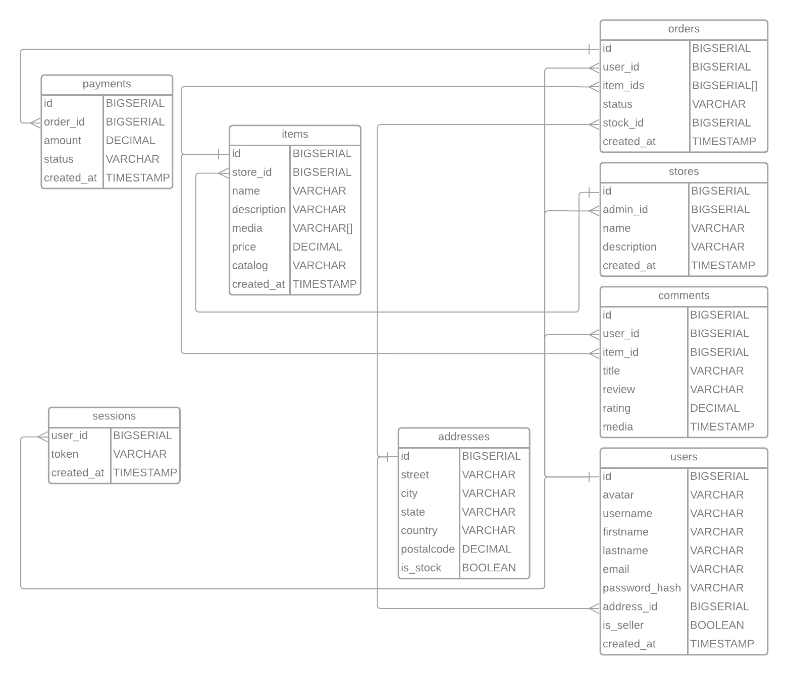

# Course work

# Amazon

## Содержание

* ### [Тема и целевая аудитория](#1)
  - #### [Тема](#1.1)
  - #### [Целевая аудитория](#1.2)
* ### [Расчет нагрузки](#2)
  - #### [Продуктовые метрики](#2.1)
  - #### [Технические метрики](#2.2)
* ### [Логическая схема](#3)

## 1. Тема и целевая аудитория 

### 1.1 Тема 

**[Amazon](https://www.amazon.com/)** - это американская организация, одна из крупнейших в мире среди компаний,
занимающихся продажей всевозможных товаров и услуг через интернет. Также это лидер в области продаж товаров массового
спроса через систему интернет-сервисов.

### MVP:

- Создание профиля покупателя / продавца.
- Добавление товара в корзину.
- Оформление заказа.
- Оценка товара с возможностью оставить комментарий.
- Навигация по товарам (каталог / поиск).
- Создание товаров / каталогов для продавцов.
- Склады и логистика.

### 1.2 Целевая аудитория 

- Месячный трафик составляет около 2.5 млрд. пользователей
- Аудитория на 59.8% состоит из мужчин и на 40.2% из женщин
- Самая большая возрастная группа посетителей - 25-34-летние (~0.7 млрд.)
- Таргетинг по странам:

| Страна         | Кол-во пользователей в месяц, % | Кол-во пользователей в месяц, млн |
|----------------|---------------------------------|-----------------------------------|
| США            | 82.67                           | 2 066 750                         |
| Канада         | 1.07                            | 26 750                            |
| Индия          | 1.06                            | 26 500                            |
| Великобритания | 0.97                            | 24 250                            |
| Япония         | 0.72                            | 18 000                            |

### [Источник](https://www.similarweb.com/ru/website/amazon.com/)

## 2. Расчет нагрузки 

### 2.1 Продуктовые метрики 

- Дневная аудитория ~28
  млн. [Источник](https://vc.ru/trade/594954-top-zarubezhnyh-marketpleysov-dlya-prodazhi-tovarov-v-2023-amazon-etsy-i-drugie)
- Месячная аудитория ~ 300 млн. [Источник](https://sell.amazon.com/blog/amazon-stats)

### Средний размер хранилища пользователя:

| Вид данных                                                          | Размер |
|---------------------------------------------------------------------|--------|
| Аватар                                                              | ~2 Мб  |
| Личные данные (адреса, заказы, платежные данные, транзакции и т.д.) | ~1 Мб  |

Итого: ~3 Мб

### Общая статистика:

- Amazon доставляет 1.6 млн. посылок в день **(1)**
- В Amazon 9.1 млн. продавцов, из которых 2.3 млн. активных

[Источник](https://landingcube.com/amazon-statistics/)

- ~40% пользователей совершают покупку 1-2 раза в месяц **(1)**

[Источник](https://amzmln.com/stati/amazon/statistika-amazon/)

> **(1)** Amazon доставляет **1.6** * 30 = 48 млн. посылок в месяц, также активных пользователей в месяц 300 млн, из них
> 40% = 120 млн. совершают 1 - 2 покупки в месяц. Соответственно, получаем, что в среднем пользователь заказывает (с
> добавлением в корзину) 120 * 1.5 / 48 = 3.75 товаров, однако это для 40% пользователей ⇒ получаем ~ **2 товара в
> посылке
** в среднем для одного пользователя.
> Выходит ~ **0.16 заказов на пользователя в месяц**. (48 млн. заказов / 300 млн. пользователей)
> И 0.16 * 2 = **0.32 товара на пользователя в месяц**.
> Предположим, что рядовой пользователь добавляет **5 товаров в корзину в месяц**.
>

- 6,264 продавцов присоединяются к Amazon ежедневно

[Источник](https://financesonline.com/amazon-statistics/)

- Согласно отчету статистической компании Marketplace Pulse на июнь 2021 года, на Amazon есть более 2,5 миллиона
  продавцов, и среди них наибольшее количество товаров предлагают крупные магазины и бренды, которые имеют более 10 000
  товаров в своем ассортименте. Однако, большинство продавцов на Amazon имеют от 1 до 100 товаров в своем ассортименте.

> Предположим, что в среднем продавец создает **5 товаров** в месяц.
>

- 1-3% пользователей оставляют ревью после покупки товара **(2)**

[Источник](https://www.quora.com/What-percentage-of-buyers-write-reviews-on-Amazon)

> **(2)** 2% пользователей в месяц (300 * 2% = 6 млн) оставляют отзыв в месяц на товар. Соответственно, 6 млн. / (48
> млн. * 2) = 6% купленых товаров получают отзыв в месяц.
>

### Среднее количество действий пользователя по типам:

| Тип запроса                                       | Запросов в месяц |
|---------------------------------------------------|------------------|
| Добавление товара в корзину                       | 5                |
| Оформление заказа                                 | 0.16             |
| Покупка товара                                    | 0.32             |
| Оценка товара с возможностью оставить комментарий | 0.02             |
| Создание товаров / каталогов                      | 5                |

### 2.2 Технические метрики 

### Хранилище товара

- Amazon рекомендует, чтобы размер изображения составлял не менее 1000 пикселей в высоту или ширину, и чтобы для
  достижения оптимального качества и сжатия использовать формат файла JPEG или PNG. В общем, размер фото товара на
  Amazon может колебаться от нескольких десятков килобайт до нескольких мегабайт, в зависимости от размеров изображения
  и его качества, возьмем среднее **1 Мб на фото**. Учитываем, что для электронных товаров, которые являются наиболее
  популярными продавцы часто прикрепляют еще и видео.
- В целом, количество фотографий для листинга продукта на Amazon может быть от 1 до 10 и более. Возьмем 5 фотографий (1
  Мб) + 2 видео (предположим 5Мб) + описание на 1 Кб, то есть приходится около 5 * 1 + 2 * 5 Мб ~= **15 Мб данных на
  каждый товар**.

[Источник](https://www.repricerexpress.com/amazon-statistics/)

- Всего товаров примерно 125 млн (учитываем, что 2.5 млн. продавцов имеют в среднем 50 товаров).

### Хранилище пользователя

- Не стоит забывать о пользователях, которые в среднем занимают 3 Мб данных.
  Активных пользователей 300 млн в месяц.

### Логистика

- Учитывая, что в месяц проходит 48 млн. заказов, каждый из которых имеет расписание доставки (1 Кб) и местоположение (1
  Кб). Получаем, что это занимает ~100 Тб, при условии, что каждый месяц данные будут удаляться при партиционировании.

> 125 000 000 * 15 + 300 000 000 * 3 + 100 000 000 = 2 875 000 000 Мб
>

Итого: **2875 Тб** или 2.875 Пб

### Сетевой трафик

В месяц 2.5 млрд. (~1000 пользователей в секунду) посетителей сайта, которые
в [среднем](https://www.similarweb.com/ru/website/amazon.com/#traffic) посещают около 9 страниц за 7 минут. Предположим,
что пользователь использует поиск по товарам 3 раза. Также делает сортировку по товарам на 3 страницах (2 каталога + 1
поиск).

В поиске отображаются 16 товаров + 20 * 2 рекомендаций = **56 товаров в поиске**.
В каталоге 24 товара + 20 * 2 рекомендаций = **64 товара в каталоге**.
Соответственно, имеем 56 * 3 + 64 * 6 (просмотр) + 16 * 1 + 24 * 2 (сортировка) = 616 товаров для отображения в
среднем (3 страницы поиск + 6 страниц каталог + 3 сортировки).

Пусть пользователь кликает на 1.6% просмотренных товаров = 10 товаров, то есть подгружает 15 Мб * 10 = **150 Мб данных
**.

Каждый товар подгружает рейтинг и сжатую картинку, условно это 500 КБайт, таких пользователь просматривает 606 штук в
среднем, то есть имеем 606 * 500 Кб = **296 Мб данных**.

То есть получаем, что серфинг сайта показывает 150 + 296 = **446 Мб**.

Протокол передачи **HTTPS**.

Соответственно, раз в 17 микросекунд подключается новый пользователь, который в среднем 9 раз с интервалом в 46 секунд
делает запрос размером 446 / 9 ~= 50 Мб. С учетом кэширования и того, что страница может быть оформлением заказа, можно
предположить, что запросы занимают около 1 Мб, также преположим, что хотя бы 1 просмотренный ****товар не был в кэше,
тогда получаем 1 + 15 ~= **16 Мб данных на серфинг**.

Новопришедших пользователей 1 000 в данную секунду (они отправляют запрос на просмотр товаров), еще есть прошлые
пользователи, которые делают n-ный запрос. Предположим, что таких запросов 19 штук (примерно в 2 раза больше, чем
просмотраивают страниц в данный момент времени остальные пользователи), поэтому прибавляем еще 19 * 1 000.

В секунду получается около 20 * 1 000 = 20 000 запросов/c для подгрузки каталога товаров.

Итого:

> 20 000 * 16 = 320 000 Мбайт/c = 2 560 000 Мбит/c = 2 500 Гбит/c
>
>
> 2 500 * 24 = 7 500 Гбайт/c
>

Трафик в секунду: **2 500 Гбит/с**

Трафик в сутки: **7 500 Гбайт/c**

### Пиковый

Будем опираться на
эту [статью](https://aws.amazon.com/blogs/compute/scheduling-aws-lambda-provisioned-concurrency-for-recurring-peak-usage/).

В пике трафик увеличивается примерно в 10 раз, соответственно получаем следующие результаты:

Трафик в секунду: **25 000 Гбит/с**

Трафик в сутки: **30 000 Гбайт/c** (все же пользователи не будут стабильно атаковать сайт день и ночь, поэтому
увеличение только в 4 раза)

### RPS

### Средний

1. Оформление заказа
   1.6 млн. заказов в день ⇒ **18.5 заказов в секунду**.
2. Покупка товара
   В 2 раза больше, чем оформление заказа ⇒ **37 товаров в секунду**.
3. Отзыв о товаре
   37 * 0.02 = **0.74** **отзывов в секунду.**
4. Поиск
   1000 * 3 = **3000 поисков в секунду**.
5. Просмотр каталога товаров
   **20 000** **каталогов в секунду**
6. Просмотр товара (превью)
   ((64 + 56) / 2) * 1 000 = **60 000 превью в секунду**.
7. Просмотр товара (полностью)
   1.6% от просмотра превью ⇒ 60 000 * 1.6% = **960 просмотров товара в секунду.**
8. Создание товара
   Пренебрежем этим действием, так как оно просиходит очень редко и, соответственно, не особо влияет на загруженность
   системы.

### Пиковый

Будем опираться на
эту [статью](https://aws.amazon.com/blogs/compute/scheduling-aws-lambda-provisioned-concurrency-for-recurring-peak-usage/).

- RPS на оформление заказа в пике может быть 200, что является увеличением в 10 раз.
- Соответственно, покупка товара будет около 600, так как пик приходится на скидки и люди покупают в среднем больше
  товаров.

Предположим, что увеличился RPS в 10 раз практически везде:

- Отзыв о товаре - 7.4 RPS
- Поиск - 30 000 RPS
- Просмотр каталога - 100 000 RPS
- Просмотр товаров - 300 000 RPS
- Просмотр товаров (полностью) - 9600 RPS

| Тип запроса                 | Средний RPS | Пиковый RPS |
|-----------------------------|-------------|-------------|
| Оформление заказа           | 18.5        | 200         |
| Покупка товара              | 37          | 600         |
| Отзыв о товаре              | 0.74        | 7.4         |
| Поиск                       | 3 000       | 30 000      |
| Просмотр каталога           | 20 000      | 100 000     |
| Просмотр товара (превью)    | 60 000      | 300 000     |
| Просмотр товара (полностью) | 960         | 9 600       |
| Создание товара             | 0           | 0           |

## 3. Логическая схема 

